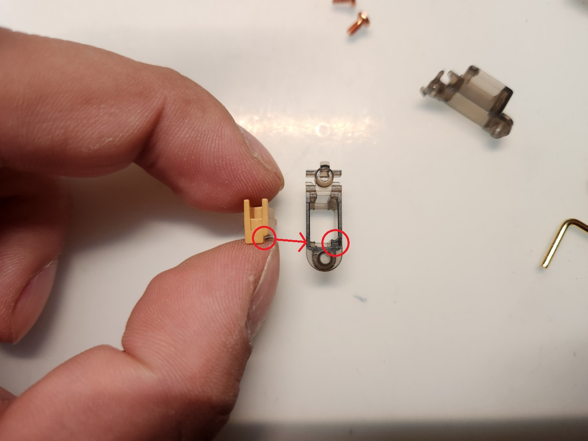
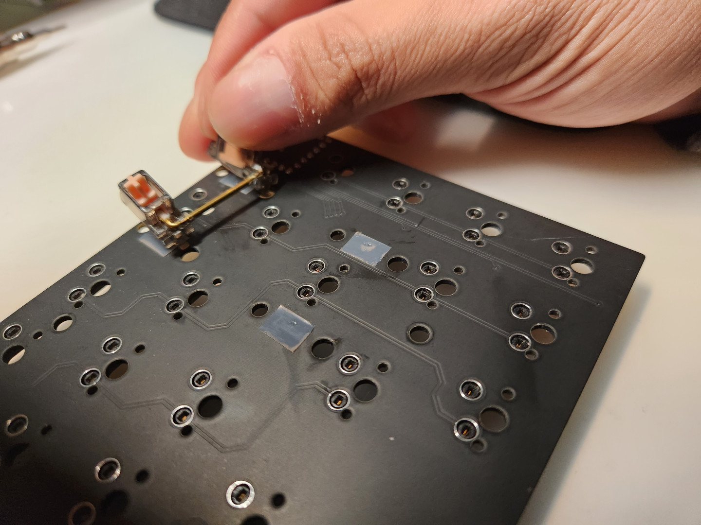
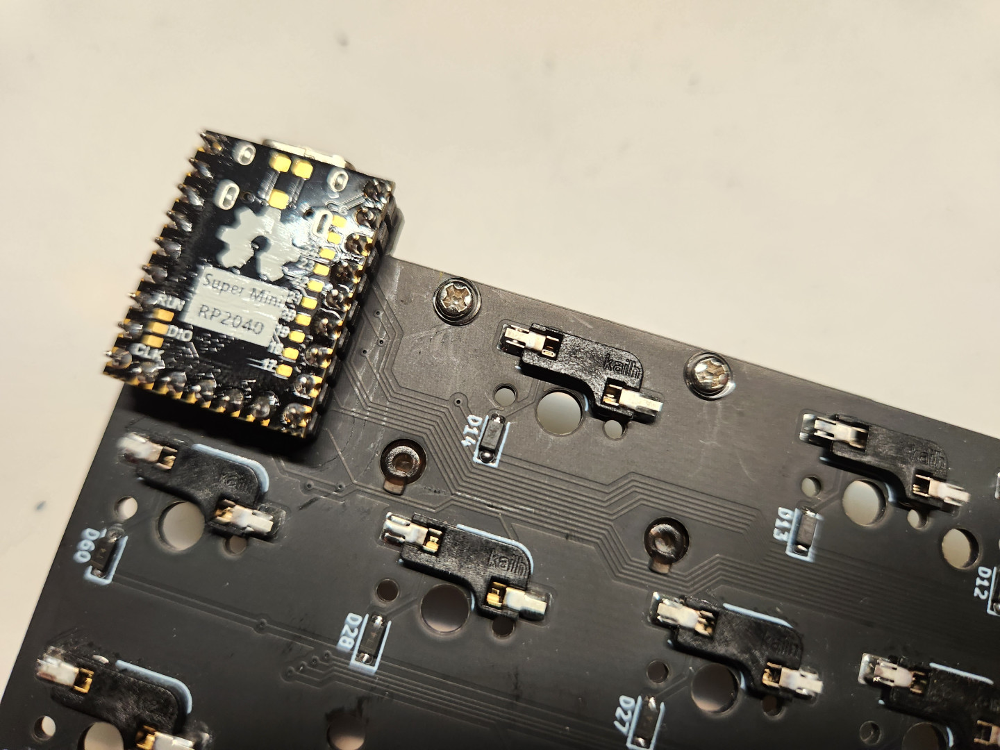
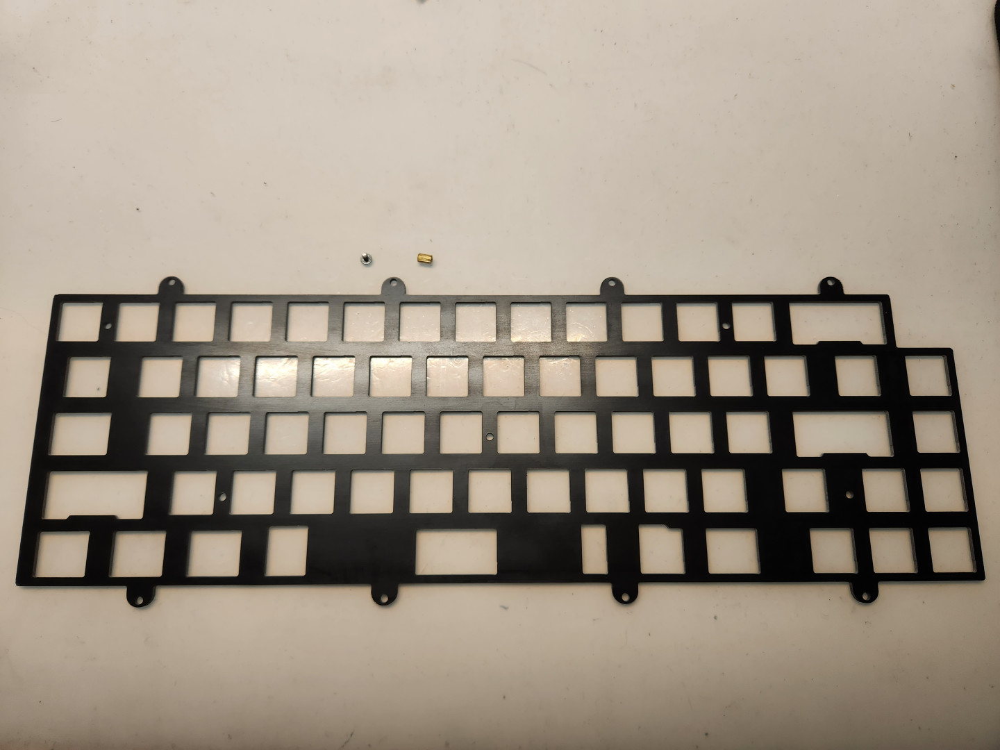
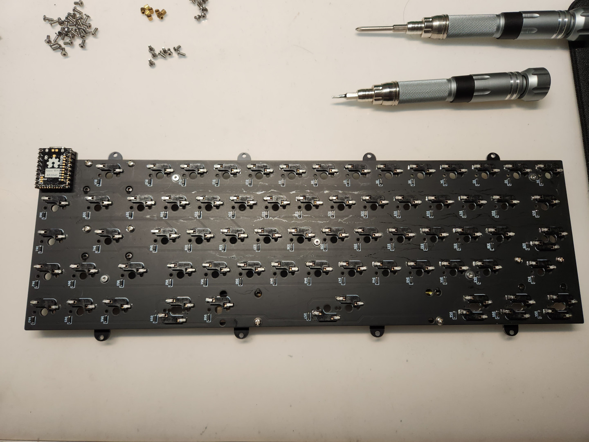

# 組裝說明 Building Guide

- 電路板及定位板。
- PCB and plate.

## 一、韌體燒錄（Firmware）

- 首先將韌體燒錄進MCU中預備，方法如下：
- First you need to flash firmware into MCU, please follow step below：

> **Note**
>
> RP2040 SuperMini/Zero系列有著跟一般RP2040 Pico一樣的燒錄韌體方法，首先你要壓著MCU上頭的`Bootloader按鈕`，再將MCU接上電腦，之後電腦本機上會出現一個`專屬的硬碟`，再將鍵盤的`.uf2`韌體丟進去就可以了。
>
> RP2040 SuperMini/Zero have same `bootloader` way, you need to keep pushing switch on the MCU `before` plug USB-C cable to the PC. After that, you can see a `disk` on your device, then put `.uf2` firmware file into disk.

## 二、二極體&熱插拔座&排針（Diodes and Hotswap sockets and Pin headers）

- 接著準備好PCB、二極體及熱插拔座，並且依序按照電路板上的方向焊接固定起來。
- Prepared the PCB, diodes and hotswap sockets, soldering and fixing in the direction of the PCB.

- 接下來準備排針及MCU，對照好PCB上的腳位，將排針安裝在PCB的背面。
- Prepare pin headers and MCU, following and installing them in the direction of the PCB on back side.

- 推薦先安裝母排針，再安裝公排針，再將MCU放上去固定好後再進行焊接。
- It is recommended to install the female pins first, then the male pins, then put the MCU on it and fix it before soldering.

- 熱插拔座、二極體、MCU安裝好之後會是這個樣子。
- IF you finished installing hotswap sockets, diodes and MCU, check picture below, it finally looks like the picture below.

## 三、衛星軸&定位板（Stablizers and Plate）

> **Note**
>
> 以我的鍵盤經驗來看，真的很多人不懂如何組裝及安裝衛星軸，再不調整鋼絲的情況下，這裡我會將完整的組裝步驟交付給大家。
>
> From my keyboard experience, really many people don't know how to assemble and install the stablizers without adjusting the wires again, here I will show the complete assembly steps to you.

- 首先準備好一組衛星軸的部件及衛星軸油脂，這裡我是使用針筒包裝的XHT-BDZ。
- First you need to prepare one set of stablizer and oil, here I use XHT-BDZ for example.

- 假軸軸心底部及外殼上會有缺口做防呆，安裝時直接將軸心跟外殼做合併。
- There are notches on the bottom of the stem and on the housing for durability, so that the stem and the housing can be merged directly during installation.

- 接著將鋼絲一端放入假軸軸心的孔洞中，如照片所示。
- Then you need to put stablizer wire in the hole on stem, like pictures below.

- 最後將鋼絲固定在外殼上的卡扣處，衛星軸的兩端都一樣。
- Finally, fasten the wire to the clips on the outer housing, the same for both ends of the stablizer.

- 接著將衛星軸潤滑脂添加在衛星軸內部即可。
- Then add `XHT-BDZ` to the inside of the stablizer stem holes.

- 準備好適合Openero65數量的衛星軸後，將他們安裝到PCB上。（這裡使用鐵氟龍膠帶貼在衛星軸假軸與PCB的接觸面，減緩衛星軸撞擊PCB的影響。）
- After prepare `3+1 sets` of steblizers, you need to install them on the PCB. (Here, Teflon tape is used to affix to the contact surface between the stem dummy and the PCB to mitigate the impact of the stem hitting the PCB.)

- 這樣衛星軸就安裝完成了。
- That you finished to install stablizers.

- 這裡首先將定位板、`M2x3mm螺絲`及`M2x5mm銅柱`準備好，依照照片的方法將銅柱固定在定位板上。
- Here, first prepare the plate, `M2x3mm screws` and `M2x5mm spacers`, and fix the spacers on the plate according to the method shown in the photo.

- 接著再將PCB及定位板合併在一起。
- Next, combine the PCB and the positioning board together.

- 從背面加上墊片後，再繼續鎖上螺絲固定。
- After adding the washers from the back side, then continue to lock the screws to secure it.

- 這裡我會推薦先將鍵軸固定在定位板及PCB上，會比較好安裝。
- Here I would recommend to fix the switches on the plate and PCB first, it will be better for installation.

## 四、外殼組裝（Install Case）