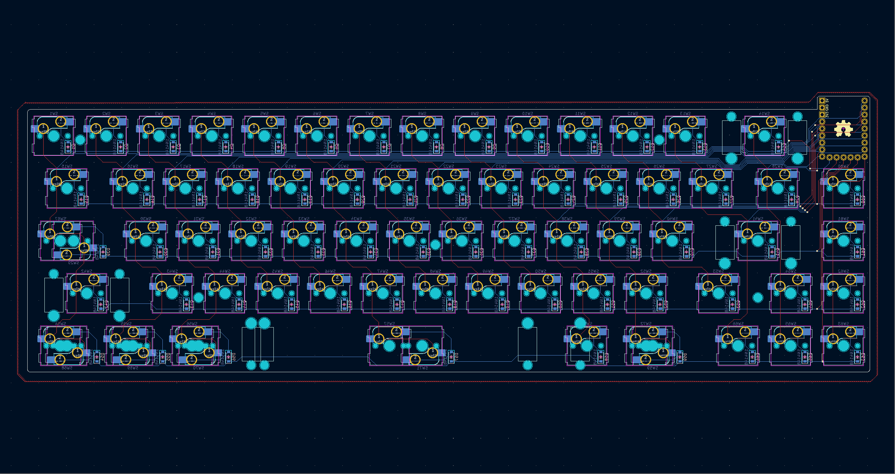

# OpeNero65

## 一、開發者前言

OpeNero65是我設計的第一把ANSI配列鍵盤，使用市面上都能輕易買到的RP2040開發板驅動，支援QMK/VIAL、多配列支持、階梯CapsLock等。本以為標準鍵盤外殼很好設計，後來發現單件CNC的價格過高，才改用堆疊外殼的設計方式，本次成品會採用3mm厚度壓克力製成。

設計堆疊殼也相當不輕鬆，特別是PCB階段它有一端是向外突起，接著開發板採用的是排針焊接固定，大大增加堆疊外殼的3D設計困難。仰角以堆疊外殼來說仰角有2種設計方式，但因為開發板固定在PCB上會有立體干涉存在，只能採用橫向堆疊的方式設計... 總體來說也經過一段時間折騰才順利完成。

## 二、設計圖預覽

|||
|---|---|
|||

## 三、材料及使用工具

### A、材料：

|名稱|數量|備註|
|---|---|---|
|OpeNero65電路板（PCB）|1片|-|
|堆疊外殼（Stacking Case）|1組|10片堆疊材料|
|微控制器（MCU）|1片|RP2040Supermini、RP2040Zero|
|公母圓排針|9pin、5pin|選配（Optional）|
|熱插拔座（Hotswap Cable）|72個|MX規格|
|M2x8mm 扁頭螺絲（Screws）|30根|-|
|M2x4mm 扁頭螺絲（Screws）|8根|-|
|M2x3mm 熱壓螺母（insert）|14個|-|
|M2x18mm 雙通銅柱（Spacer）|2根|-|
|M2x12mm 雙通銅柱（Spacer）|10根|-|
|MX鍵軸|65-66個|-|
|PCB衛星軸（Stablizers）|1組|-|
|22058或XHT-BDZ|-|-|

### B、使用工具：
- 電烙鐵及相關工具組（Solder gun and other packs）。
- 精密螺絲起子組（Screwdriver set）。
- 防靜電金屬鑷子（Anti-static metal tweezers）。
- 拔鍵器（Keycaps puller）。
- 拔軸器（Keyswitch puller）。
- 細毛毛刷（Brushes for stablizers）。

材料及工具準備好之後，點我前往[組裝說明](guide.md)。

## 四、參考及使用資料
- KiCAD version 7.05。
- Autodesk Fuision360。
- JLCPCB。
- QMK firmware。
- VIAL。
- Million Plastic Corp.。