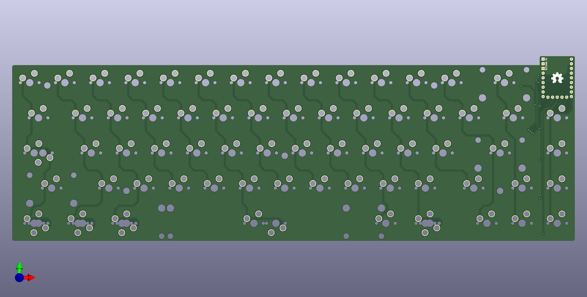

# OpeNero65

## 開發者前言

OpeNero65是我設計的第一把ANSI配列鍵盤，使用市面上都能輕易買到的RP2040開發板驅動，支援QMK/VIAL、多配列支持、階梯CapsLock等。本以為標準鍵盤外殼很好設計，後來發現單件CNC的價格過高，才改用堆疊外殼的設計方式，本次成品會採用3mm厚度壓克力製成。

設計堆疊殼也相當不輕鬆，特別是PCB階段它有一端是向外突起，接著開發板採用的是排針焊接固定，大大增加堆疊外殼的3D設計困難。仰角以堆疊外殼來說仰角有2種設計方式，但因為開發板固定在PCB上會有立體干涉存在，只能採用橫向堆疊的方式設計... 總體來說也經過一段時間折騰才順利完成。

## 設計圖預覽

|||
|---|---|
|||

## 材料準備

## 參考及使用資料
- KiCAD version 7.05。
- Autodesk Fuision360。
- JLCPCB。
- QMK firmware。
- VIAL。
- Million Plastic Corp.。