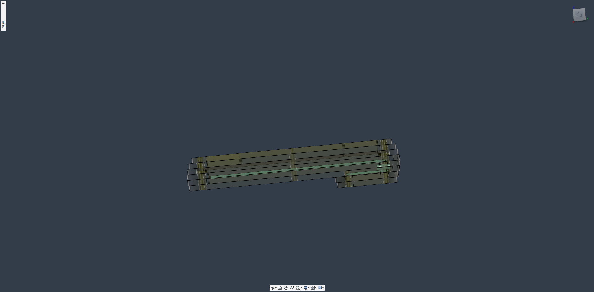

# OpeNero65

## 一、開發者前言

OpeNero65是我設計的第一把`ANSI配列`鍵盤，使用市面上都能輕易買到的RP2040開發板驅動，支援`QMK`/`VIAL`、多配列支持、階梯CapsLock等。本以為標準鍵盤外殼很好設計，後來發現單件CNC的價格過高，才改用堆疊外殼的設計方式，本次成品會採用3mm厚度壓克力製成。

OpeNero65 is the first ANSI keyboard I designed, it is driven by the RP2040 development board which can be easily purchased in the market, and it supports `QMK`/`VIAL`, multi-compatibility support, and ladder CapsLock, etc. Originally, I thought the standard keyboard case is very easy to design, then I found that the price of a single CNC is too high, so I switched to the stacked case design. Originally thought the standard keyboard case is very good design, but later found that the price of a single piece of CNC is too high, and then changed to the stacked case design, the finished product will be made of 3mm thickness acrylic.

設計堆疊殼也相當不輕鬆，特別是PCB階段它有一端是向外突起，接著開發板採用的是排針焊接固定，大大增加堆疊外殼的3D設計困難。仰角以堆疊外殼來說仰角有2種設計方式，但因為開發板固定在PCB上會有立體干涉存在，只能採用橫向堆疊的方式設計... 總體來說也經過一段時間折騰才順利完成。

The design of the stacked case is not easy, especially at the PCB stage it has an end that protrudes outward, and then the development board is fixed with rows of pins, which greatly increases the difficulty of the 3D design of the stacked case. Elevation angle to stack the case of the elevation angle of two design methods, but because the development board fixed on the PCB will have three-dimensional interference exists, can only be used in a horizontal stacking design... Overall, also after a period of time to successfully complete.

## 二、設計圖預覽

|||
|---|---|
|||
|||
|||

## 三、材料及使用工具

### A、材料：

|名稱|數量|備註|
|---|---|---|
|OpeNero65電路板（`PCB`）|1片|-|
|堆疊外殼（Stacking Case）|1組|10片堆疊材料|
|微控制器（`MCU`）|1片|`RP2040Supermini`、`RP2040Zero`|
|公母圓排針|`9pin`、`5pin`|選配（`Optional`）|
|熱插拔座（Hotswap Sockets）|72個|`MX`規格（for MX switches）|
|`M2x5mm` 扁頭螺絲（Screws）|30根|-|
|`M2x4mm` 扁頭螺絲（Screws）|8根|-|
|`M2x3mm` 扁頭螺絲（Screws）|20根|-|
|`M2x18mm` 雙通銅柱（Spacer）|2根|-|
|`M2x12mm` 雙通銅柱（Spacer）|10根|-|
|`M2x5mm` 雙通銅柱（Spacer）|11根|-|
|`M2x3mm` 雙通銅柱（Spacer）|8根|-|
|`PCB`衛星軸（Stablizers）|1組|`2u`、`6.25u`/`7u`|
|衛星軸用潤滑酯|-|`Permatex 22058`/`81150`或`XHT-BDZ`|
|防滑腳貼（Rubber feets）|5個|高度隨個人而定|
|外徑`5mm` 內徑`2mm` 橡膠圈（Outer `ø5mm`, inner `ø2mm` O-rings）|15個|選配（`Optional`）|
|`M2` 防滑墊片（`M2` washers）|10個|選配（`Optional`）|

### B、使用工具：

- 電烙鐵及相關工具組（Solder gun and other packs）。
- 精密螺絲起子組（Screwdriver set）。
- 防靜電金屬鑷子（Anti-static metal tweezers）。
- 拔鍵器（Keycaps puller）。
- 拔軸器（Keyswitch puller）。
- 細毛毛刷（Brushes for stablizers）。

### C、注意事項：

> **Warning**
>
> 使用電烙鐵時注意用電、用火安全，環境通風。
> 
> Be carefull on fire and electricity safety when soldering in environmental ventilation.

> **Warning**
>
> 定製外殼前務必瞭解自身需求的鍵盤佈局（例如6.25u、7.00u Spacebar；WK、WKL等）。
> 
> Please understood which keyboard layout you need before making/ordering case. (ex: 6.25u, 7.00u spacebar; WK, WKL...)

> **Warning**
>
> 在定製製作Openero65外殼之前一定要特別注意，壓克力板一定會有`0.1-0.35mm`左右的公差存在，成品會比實際用計算機計算來的小一些。
> 
> Before you oeder cases from factory, arcylic boards must exist tolerances about `0.1-0.35mm`, the finished product will be smaller than the actual calculator.

> **Warning**
>
> 請準備個人喜歡的MX鍵軸65-66顆，以及調整衛星軸鋼絲的前置動作。
> 
> Please prepare 65-66 personal MX switches and adjusted stablizer wires before building keyboard.

材料及工具準備好之後，點我前往[組裝說明](guide.md)。

## 四、參考及使用資料
- [QMK Firmware](https://qmk.fm/).
- [VIAL](https://get.vial.today/).
- [KiCAD](https://www.kicad.org/) version `7.0.5.`
- [JLCPCB](https://jlcpcb.com/).
- [DeepL](https://www.deepl.com/translator)
- [AutoDesk Fusion360](https://www.autodesk.com/products/fusion-360/free-trial).
- Taiwan [Tatung University](https://www.ttu.edu.tw/) - [Department of Mechanical and Materials Engineering](https://mme.ttu.edu.tw/)
- And my friend: [YCT](https://github.com/yct38)